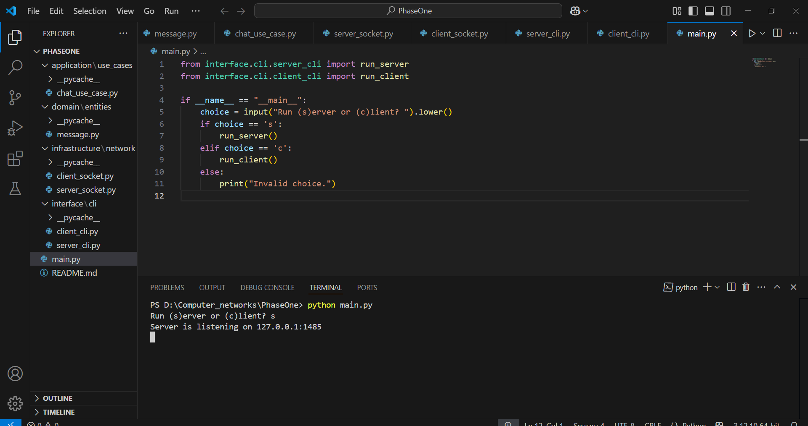
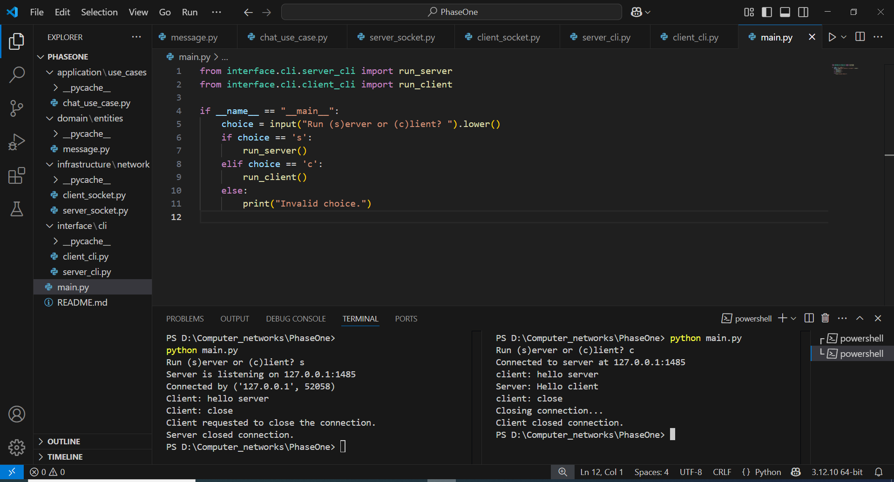
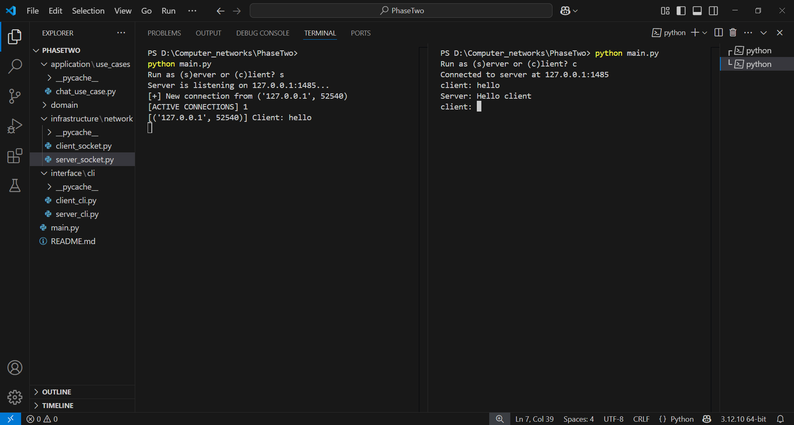
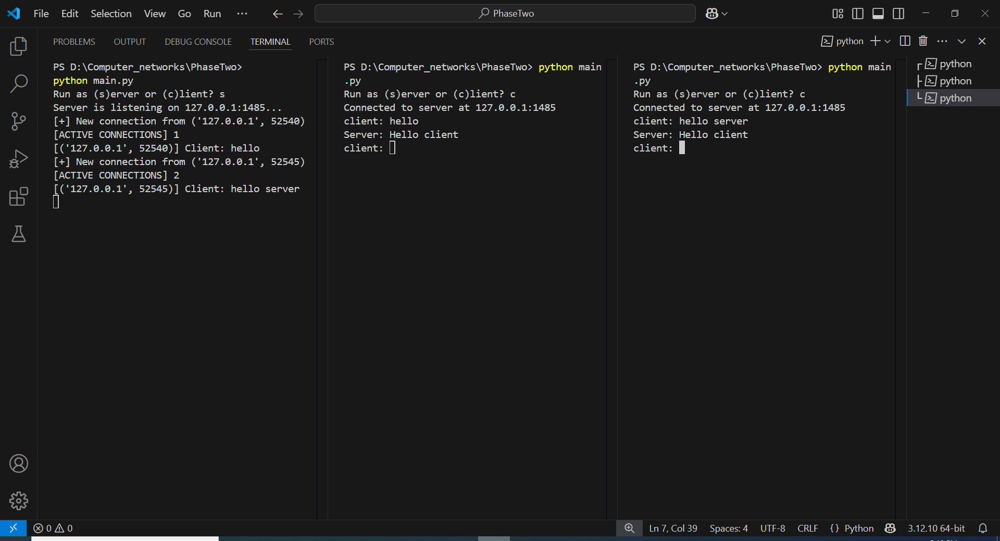
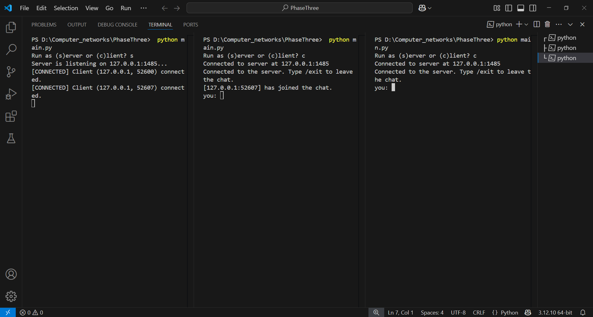
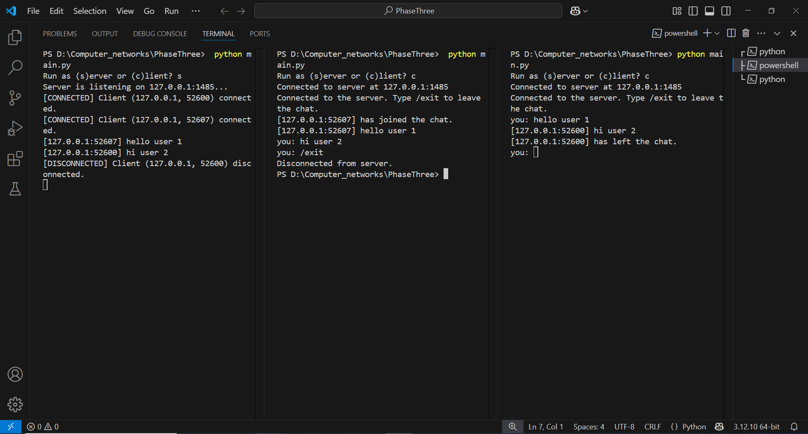
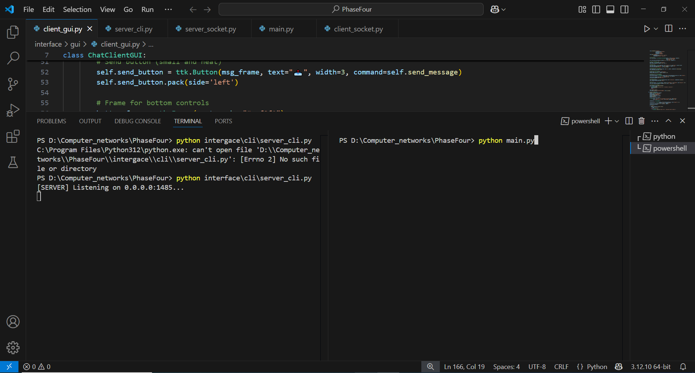
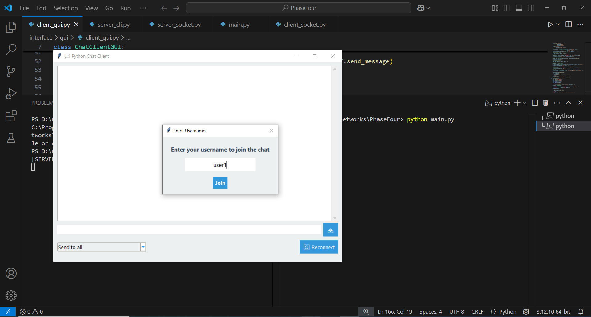

# Socket Communication Project 

## 📑 Table of Contents
1. Project Overview
2. Phases Implementation
   - Phase One: Basic Client-Server Communication
   - Phase Two: Multi-Client Support
   - Phase Three: Broadcast Messaging
   - Phase Four: GUI Implementation (Bonus)
3. Technical Architecture
4. Project Structure


## 1. Project Overview
This project implements a scalable socket communication system with four progressive phases, evolving from basic client-server interaction to a full-featured messaging application.

## 🚀 Getting Started(For phase One to Three)

```bash
python --version
```

### 1. Clone the repository

Clone the project to your local machine:

```bash
https://github.com/MedyaRezaei/Socket_project.git
```

### 2. Run the server

In one terminal window, start the server:

```bash
python main.py
```

When prompted, enter `s` to run as the server.

### 3. Run the client

In a separate terminal window, run the client:

```bash
python main.py
```

When prompted, enter `c` to run as the client.

❗ Note: Each client must enter their **own IP address** when connecting.
The server IP should match the machine running the server.

### 4. Chat Usage

- **Message Handling**: Clients can send messages to the server. The server will broadcast the messages to all connected clients.
- **Server Response**: The server responds with the content of the messages received.
- **Exiting**: Type `/exit` to close the client connection.
- **Message Filtering**: Clients will no longer see their own messages in the chat. Only messages from other clients will be displayed on the client’s terminal.


## 2. Phases Implementation

### 🔹 Phase One: Basic Client-Server Communication
**Implementation Details:**
- Established TCP socket connection
- Simple "Hello World" message exchange
- Graceful connection termination

**Screenshots:**



**Verification:**
- Server successfully listens on specified port
- Client establishes connection and exchanges messages
- Proper connection closure implemented

### 🔹 Phase Two: Multi-Client Support
**Implementation Details:**
- Thread-based multi-client handling
- Client IP logging
- Concurrent message processing

**Screenshots:**



**Verification:**
- Server handles ≥5 simultaneous connections
- Each client receives personalized responses
- IP addresses properly logged

### 🔹 Phase Three: Broadcast Messaging
**Implementation Details:**
- Group messaging functionality
- Live message display
- "/exit" command implementation

**Screenshots:**



**Verification:**
- Messages broadcast to all connected clients
- Sender identification included
- Clean exit functionality working

### 🔹 Phase Four: GUI Implementation (Bonus)
🚀 Getting Started(for final Phase)

### 1. Clone the repository

Clone the project to your local machine:


```bash
https://github.com/MedyaRezaei/Socket_project.git
```


### 2. Run the server

In one terminal window, start the server:
```bash
 python interface\cli\server_cli.py
```
### 3. Run the client

In a separate terminal window, run the client:
```bash
python main.py
```

❗ Note: Each client must enter their **own IP address** when connecting.
The server IP should match the machine running the server.
### 4. Chat Usage

- Clients can send public or private messages.
- To send a private message, choose user in chat box `
- Type `/exit` to leave the chat.

### 5. Troubleshooting

- Make sure server and client run in different terminals.
- If disconnected, use the Reconnect button in the GUI.
- The server will shut down gracefully with `CTRL+C`.

**Implementation Details:**
- Graphical user interface
- Error handling improvements
- Private messaging capability

**Screenshots:**




**Verification:**
- Functional GUI for messaging
- Robust error handling
- Private messages delivered correctly

## 3. Technical Architecture
- Clean Architecture implementation
- Language: Python 3.10+
- Communication Protocol: TCP/IP
- GUI Framework: Tkinter (Phase 4)

<pre> ```📁 Project Structure PhaseFour/ ├── domain/ │ └── entities/ │ └── message.py # Message entity logic ├── application/ │ └── use_cases/ │ └── chat_use_case.py # Message processing logic ├── infrastructure/ │ └── network/ │ ├── server_socket.py # Multithreaded server socket logic │ └── client_socket.py # Client socket implementation ├── interface/ │ ├── cli/ │ │ ├── server_cli.py # Server CLI interface │ │ └── client_cli.py # Client CLI (legacy fallback) │ └── gui/ │ └── chat_client_gui.py # GUI chat client ├── main.py # Entry point to run server or client └── README.md # Project documentation ``` </pre>


##👨‍💻 Author
Medya Rezaei
